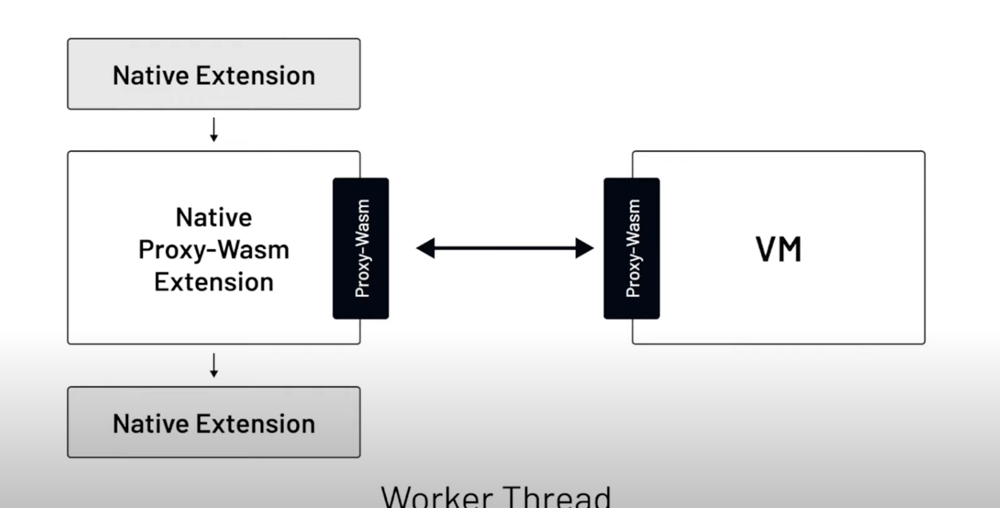

# Envoy 101

> An opensource edge and service proxy.

Comparable to NGINX, HAProxy

## Overview

- A programmable L4 and L7 proxy
- Uses sidecar proxy pattern
- Runs alongside every application and abstracts the network component

## Compared to NGINX, HAProxy

- NGINX's business model creates tension between its commercial product and its OSS offering
- HAProxy has less forward community/velocity
- Envoy (released in 2016) was designed from the start for microservices

## Programming Envoy
- Envoy exposes APIs to dynamically configure the proxy (vs. using static files)
- **Listeners** can be configured to enable traffic flow through proxy
- **Filters** can enhance the data flow

<pre>        
               ┌─────────────────────────────────────────────────┐               
               │                                                 │               
┌──────────┐   │  ┌──────────┐    ┌──────────┐    ┌──────────┐   │   ┌──────────┐
│ Listener │◀──┼─▶│  Filter  │◀──▶│  Filter  │◀──▶│  Filter  │◀──┼──▶│ Service  │
└──────────┘   │  └──────────┘    └──────────┘    └──────────┘   │   └──────────┘
               │                                                 │               
               └──────────────────Filter chain───────────────────┘               

</pre>

## Types of Filters

- **Listener Filters**: access raw data, manipulate *metadata* of L4 connections during initial pre-connection phase.
- **Network Filters**: access and manipulate raw data on L4 connections, eg. TCP packets.
- **HTTP Filters**: operate at L7; access and manipulate HTTP requests/responses

## Creating Filters

If the pre-built filters aren't sufficient, you can write your own.

**Options**:
- Native C++
- Lua-based filter: Use the existing HTTP Lua filter to add an inline Lua script (fine for less complex filters)
- Wasm-based filter: Create filter as separate Wasm module, have Envoy dynamically load it during runtime
  - 1. Load Wasm module by pointing it to a local .wasm file accessible by the proxy
  - 2. Use remote fetch and have Envoy download the .wasm file for you

## Wasm in Envoy
- Envoy embeds a subset of a V8 VM
- Envoy uses a multi-threaded model: 1 main thread handles config updates + global tasks, worker threads proxy individual TCP connections/HTTP requests. Worker threads are independent from each other.

### Proxy-Wasm

- Proxy-Wasm extension gets distributed as a WAsm module (.wasm file)
- At runtime, Envoy loads every Wasm module (all .wasm files) into a unique Wasm VM
- Envoy creates a separate replica of Wasm VM for every thread on which the extension will be executed
- Proxy-Wasm is a "proxy-agnostic binary interface (ABI) standard" that specifies how proxies (host) and Wasm modules interact
  - these interactions are functions and callbacks

#### Resources
- https://blog.getambassador.io/envoy-vs-nginx-vs-haproxy-why-the-open-source-ambassador-api-gateway-chose-envoy-23826aed79ef
- https://blog.envoyproxy.io/how-to-write-envoy-filters-like-a-ninja-part-1-d166e5abec09
- [Tetrate-Episode 07: Developing Envoy Wasm Extensions
](https://youtu.be/JIq8wujlG9s?t=1137)