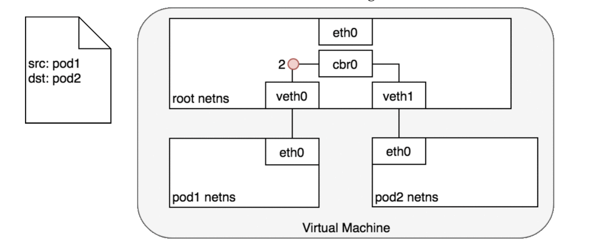

# Kubernetes Networking

## Container-to-container
- Containers in the same pod can communicate with each other via `localhost`
- Containers in the same pod must coordinate on port usage

## Pod-to-pod, same node
- Every pod gets its own unique IP address
- All containers within the pod share the same network space, including IP address and ports
- Pods on the same node can communicate with all pods on the same node without NAT
- Agents on a node can communicate with all pods on the node
- Every Linux machine has a root network namespace that all processes have access to, `eth0`
- Linux also features **veth** pairs, virtual Ethernet devices, that connect two network namespaces
- Every pod gets a pair of virtual network devices, 1 in pod's ns (eg `eth0`), 1 in the root ns (eg `veth0`)
  - this connects the pod ns to the root ns, but we still need to connect the two pods' root veths to each other

### Network bridge
- Layer 2 networking device that connects 2 networks together (in this case, connects two pods' root ns veths)
- keeps a forwarding table between sources and destinations
- Implements the ARP protocol to discover the Mac address associated with an IP

## Pod-to-pod, different nodes
- Pod IPS must be reachable across nodes. How this is done generally depends on the CNI (Container Networking Interface) plugin.
- Every node is assigned a CIDR block specifying the IPs available to that node's pods
- Once traffic for the node's CIDR block reaches it, it's the node's responsibility to forward to the correct pod

### CNIs
- An interface between network providers and k8s pod networking
- Provides an API for connecting containers to the outside network
- eg. AWS VPC CNI enables AWS VPC networking for k8s clusters
- other common CNI providers: canal, flannel, calico, weave

### AWS' ENIs
- Elastic network interfaces
- Every EC2 instance is bound to an ENI; all ENIs are connected within a VPC
- Can have multiple ENIs for one EC2 instance
- AWS CNI plugin creates a new ENI for each pod, which exposes each pod's IP within the VPC

## Pod-to-Service

Pods are ephemeral; their IPs change when recreated.

**Services** are an abstraction for a group of pods
- Services assign a ClusterIP (a virtual IP) to a group of pod IPs
- ClusterIP services are the default Services
- ClusterIP is only reachable inside a cluster

### In-cluster load balancing mechanisms

- **netfilter** is a Linux framework that provides packet filtering kernel hooks used by iptables
- **iptables**: defines rules for manipulating/transforming packets using netfilter
  - essentially load balances pods behind the Service virtual IP
  - When a change to a Service or pod updates either the virtual IP of the Service or the IP of a pod, the iptable rules are updated
  - the iptables rules watch for traffic destined for a Service's virtual IP, then selects a random pod IP and changes the packet's destination IP from the Service virtual IP to the pod IP
- **IPVS (IP virtual server)**: recent k8s feature

### DNS
- DNS can be used to avoid hardcoding a Service's cluster IP to an app
- k8s DNS = a k8s Service on the cluster that configures the kubelet agents on each node to use the DNS to resolve DNS names
- Every Service is assigned a DNS name
- A DNS pods consists of 3 containers:
  - `kubedns`: watches control plane for changes to Services, Endpoints. Maintains in-memory lookup for DNS requests,
  - `dnsmasq`: provides DNS caching
  - `sidecar`: provides healthcheck endpoint for kubedns, dnsmasq

## External-to-Service
- Intra-cluster communication needs something like a service mesh, where Istio comes in

### Egress - traffic exiting cluster
- Performs NAT for instances with public IP addresses
- NAT changes a node's internal IP address to a public one

### Ingress - traffic reaching cluster

#### Layer 7 ingress: NodePort
- Service type: nodePort
- Opens a specific port on all the nodes; any traffic sent to this port is forwarded to the Service
- `targetPort`: port that the application is listening on
- Cons:
  - can only have one service per port
  - ports must be in 30,000-32,767 range
  - not recommended for prod

#### Layer 4 ingress: LoadBalancer
- Default/standard for many managed k8s installations
- Cloud provider creates a load balancer for a newly deployed service
- All traffic on specified port is forwarded to service
- iptables on each node direct incoming traffic from load balancer to correct pod
- Only understand node IPs (not pod IPs)
- Supports multiple ports per Service
- Cons:
  - each service exposed with a LB gets its own IP (can be costly)

### Layer 7 ingress: Ingress Controllers
- Not a type of Service; always implemented by a 3rd party proxy
- Sits in front of services and acts as a smart router to the cluster (get SSL, auth, routing features)
- eg. Google Cloud Load Balancer, Nginx, Istio, Contour
  - GKE's ingress controller spins up an L7 HTTP(S) load balancer
- Powerful. Useful for exposing multiple services under the same IP

---

#### Resources
- [A Guide to the Kubernetes Networking Model - 2018](https://sookocheff.com/post/kubernetes/understanding-kubernetes-networking-model/#container-to-container)
