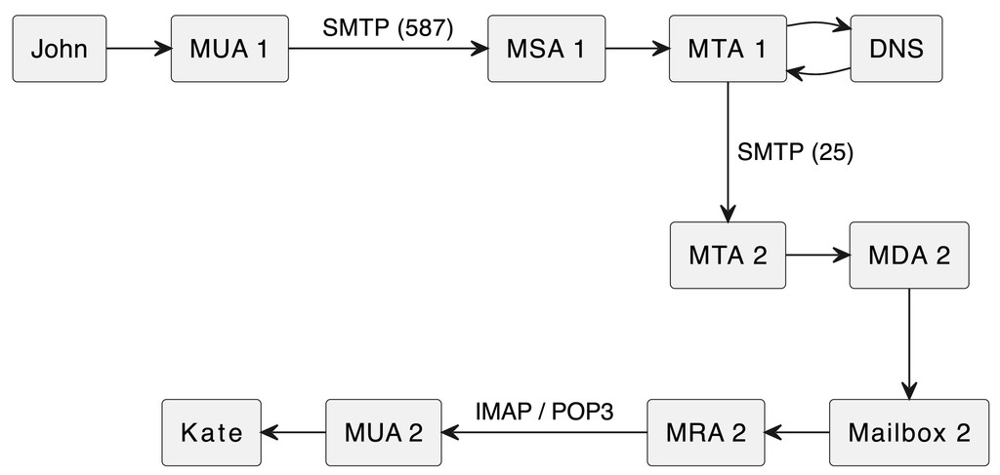

# How email works



## Sending an email

1. Sender uses email client (aka Mail User Agent, MUA)
2. The MUA stores the addresses of incoming (server that handles receiving emails), and outgoing mail servers (server that handles outgoing emails).
    - eg. Gmail's outgoing mail server: `smtp.gmail.com`
3. The MUA goes to the address of the outgoing mail server (via SMTP on port 587) to reach the Mail Submission Agent (MSA).
    - MSA is like a post office employee, receives letters but not the person delivering the letters
4. The MSA passes the email to the Mail Transfer Agent (MTA)
5. The MTA saves the emails to a queue (mail SPOOL), then sends them in turn.
6. The MTA looks up the recipient domain (`gmail.com`) makes a request to the DNS server to get the `MX` record for the domain.
7. The DNS server responds with list of mail servers with priorities (lower number = higher priority)
8. The MTA tries to send the email to the mail server (via SMTP on port 25) starting from the server with the highest priority.
    - SMTP handshake commands from client:
        - `HELO` or `EHLO`: Initiates the SMTP session. Client greets server and introduces self. `EHLO` is the ESMTP version.
            - The receiving SMTP server acks with list of supported services (`250`)
        - `MAIL FROM`: Initiates a mail transfer w/ sender info.
            - Receiving SMTP server acks to indicate if can accept messages from this sender (`250`)
        - `RCPT TO`: Recipient info.
            - Receiving SMTP server checks that the receipient exists (`250`)
    - The message transfer itself
        - `DATA`: Client asks permission to transfer the email data (incl. date, header, subject line, to header, attachments, etc)
            - Receiving SMTP server grants permission (`354`).
    - Closing connection
        - `QUIT`: Client server wants to close connection.
            -  Receiving SMTP server responds ok (`221`).

9. MTA response codes:
    - `2xx`: Success
    - `3xx`: Accepted, but server requires additional info. Send another command with the info.
    - `4xx`: Failed, but temporary. Try again later.
    - `5xx`: Failed. Shouldn't try again.

## Receiving an email

1. Recipient's MTA accepts the email, checks it (delegates checking spam to `Rspamd` and if it actually came from specified domain) and passes onto the Mail Delivery Agent (MDA)
    - If spam, may return error to sender or add a `X-Spam: Yes` header
2. The MDA saves incoming emails in user's mailboxes.
    - Emails with `X-Spam:Yes` headers are put in spam folders
3. The recipient's MUA still needs to find out about the new email. It periodically checks with the Mail Retrieval Agent if new emails have appeared (configurable). Communication between these two are either via IMAP or POP3.
    - eg. Gmail's incoming mail servers: `imap.gmail.com`, `pop.gmail.com`

## IMAP, POP3

Both are used by mail clients to receive emails from a mailbox on a mail server.

### POP3
- Downloads all emails from mailbox to local device, then deletes from server.
- Can configure to store email copies somewhere, but another device can't download them.
- All emails are only available from 1 device

### IMAP (Internet Message Access Protocol)
- Enables using a mailbox from multiple devices
- Emails remain on server and are marked (eg. as open)

## SMTP Ports

- SMTPS is SMTP + TLS
- TLS here verifies where the email traffic originated from
- Port 25: the standard port for SMTP, non-encrypted. But lots of ISPs block it due to being too spammy.
- Port 587: the default port after 1998, SMTP w/ TLS (SMTPS)
- Port 465: SMTP w/ SSL. should no longer be used for SMTP, as the IANA has reassigned this port.
    - made moot by `starttls` (but some sources say this is less safe)
- Port 2525: the alternate port, if 587 is bloc­ked.

## MX Records

Checking MX records for a domain

```sh
$ nslookup -type=mx gmail.com

Server:		8.8.8.8
Address:	8.8.8.8#53

Non-authoritative answer:
gmail.com	mail exchanger = 10 alt1.gmail-smtp-in.l.google.com.
gmail.com	mail exchanger = 40 alt4.gmail-smtp-in.l.google.com.
gmail.com	mail exchanger = 20 alt2.gmail-smtp-in.l.google.com.
gmail.com	mail exchanger = 5 gmail-smtp-in.l.google.com.
gmail.com	mail exchanger = 30 alt3.gmail-smtp-in.l.google.com.
```
or

```sh
$ dig -t MX +short gmail.com

5 gmail-smtp-in.l.google.com.
40 alt4.gmail-smtp-in.l.google.com.
20 alt2.gmail-smtp-in.l.google.com.
30 alt3.gmail-smtp-in.l.google.com.
10 alt1.gmail-smtp-in.l.google.com.
```

If recipient does not have MX record set up, emails will not be delivered.

## Email spoofing

- Email headers can be forged.
- The `MAIL FROM` SMTP command can have a different sender than header `FROM`.
- SMTP doesn't have built-in way to authenticate emails

### SPF records
- Sender Policy Framework records list the servers authorized to send emails from a domain. More of a sender-side mechanism that the recipient should check.
- It's specified by the sender's domain (not recipient's), but if a *recipient* domain does not have SPF records, it's not doing SPF checks and isn't verifying if the sender is authorized to send emails on behalf of the sender's domain. Won't detect email spoofing.
- Does not check/align the `From` address

### DKIM records
- DomainKeys Identified Mail records use cryptographic keys for auth (public/private)
- Public key is in DKIM record, private key signs the DKIM header
- Sending mail server (the MTA part) signs outgoing email with private key; recipient's mail server verifies with public key provided in the DKIM signature
- If receipient domain has no DKIM records, DKIM verification can't be performed on incoming emails. Recipient server may still accept the email.
- May check the `From` address indirectly (the `d=` field in the DKIM signature if expected to align with the `From` domain), but not the main purpose.

### DMARC records
- Domain-based Message Authentication Reporting & Conformance records contain DMARC policies, which tell email servers what to do after checking SPF, DKIM records.
- So relies on SPF and DKIM to work
- Checks alignment of the `From` domain to domains auth'd by SPF, DKIM.
- Can be configured with rules on whether to block/allow messages
- If recipient domain doesn't have SPF records, DMARC checks would also fail
- If recipient domain doesn't have  DMARC records, but does have SPF, there'll still be a pass/fail from the SPF check, and the server can decide what to do. DMARC can just be used for stricter/standardized enforcement.