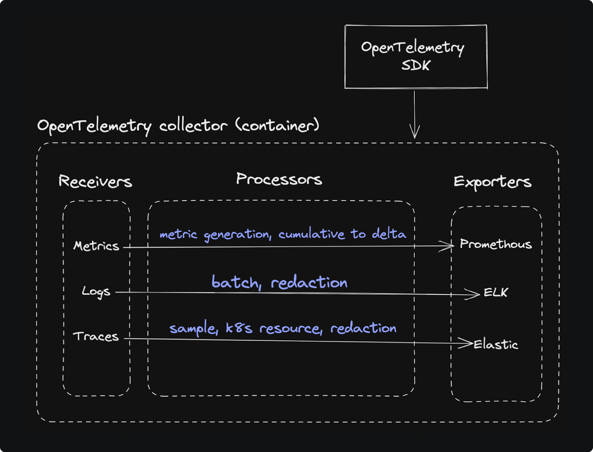

# OpenTelemetry Collector (otel collector)

## Overview

The otel collector receives telemetry data sent by the otel SDK (or any compatible otel producer) and delivers to flexible destinations.

## Architecture

The otel collector has 3 main components:

1) receivers
2) processors
3) exporters

### Receivers

Responsible for receiving spans from applications.

- otel SDK facilitates creating spans and exporting them to the receiver (which listens for calls on a specific port on the collector)
- can be configured to accept both gRPC and HTTP
- [list of available receivers](https://github.com/open-telemetry/opentelemetry-collector-contrib/tree/main/receiver)

The receiver receives all traces, but the processor decides what to forward.

### Processors

Responsible for manipulating received data before exporting to backend/DB.

- Common uses are: sampling (deciding which spans to forward), data alteration (removing sensitive data), exporting metrics from spans (aggregate data into metrics)
- [list of available procesors](https://github.com/open-telemetry/opentelemetry-collector-contrib/tree/main/processor)

### Exporters

Responsible for taking otel-specified telemetry data (OLTP format?) and converting to a different format and sending to specified endpoints.

- [list of available exporters](https://github.com/open-telemetry/opentelemetry-collector-contrib/tree/main/exporter)

## Ways of running otel collector

### As an agent

- runs at same host as app (can be as container)
- pros: can add insights on host (IP, hostname), receives data faster, can offloaad responsbilities belonging to the app (batching/compression/retry)

Then sends data to the Gateway Collector.

### As a gateway

- runs as a standalone machine, but each collector instance is independent (can use a gateway cluster to put gateway instances behind a load balancer to scale)
- serves as central point for telemetry of entire distributed architecture
- pros: provides advanced capabilities (eg. tail-based sampling), helps with API token management, reduces egress points to send data

## Deployment methods

1) All microservices interact directly w/ a single collector instance as a gateway
2) Each microservice writes to an agent running on the same host; the agent writes to the centralized collector gateway (more infra overhead)