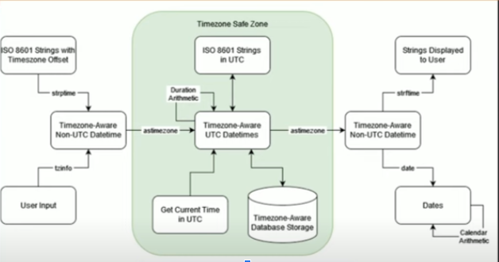

# Datetime

[Pycon 2022 talk: Handling timezones in Python](https://www.youtube.com/watch?v=XZlPXLsSU2U)

### Advice
- Don’t use naive datetimes: `datetime(2022, 1, 1, 12, 0)`
  - A naive datetime is the concept of a time and date
- An aware datetime: `datetime(2022, 1, 1, 12, 0, tzinfo=timezone.utc)`
  - A point in time
- Avoid the following naive functions:
  - `datetime.now()`
    - use `datetime.now(timezone.utc)` instead
    - `datetime.now(ZoneInfo(”America/New_York”)).date()`
  - `datetime.utcnow()`
  - `date.today()`
  - <aware_datetime>`.replace(tzinfo=XXX)` - numbers don’t change, just sets tzinfo. OK on a naive datetime.
    - Use `astimezone(timezone.utc)` instead
- Avoid duration and arithmetic outside of UTC
- Avoid `pytz` library; it's old/incompatible with the Python standard lib
  - Use Python’s standard lib `zoneinfo` instead
    ```python
    from zoneinfo import Zoneinfo
    
    tz = ZoneInfo(“America/New_York”)
    dt = datetime(2022, 4,6,12,0, tzinfo=tz).isoformat()
    ```
- Convert datetime to a date in a timezone
  ```python
  dt = datetime(2022, 1, 1, 12, 0, tzinfo=timezone.utc)
  dt.astimezone(ZoneInfo(“America/New_York”)).date()
  date(2022,4,5)
  ```
- Display UTC as localtime
  ```python
  dt = datetime(2022, 1, 1, 12, 0, tzinfo=timezone.utc)
  tz = ZoneInfo(”America/New_York”)
  dt.astimezone(tz).strftime(“%x %x”)
  ````
- Convert naive datetime to UTC
  ```python
  tz = ZoneInfo(”America/New_York”)
  local_dt = datetime(2022, 1, 1, 12, 0, tzinfo=tz)
  local_dt.astimezone(timezone.utc)
  ```
  alternatively, add a timezone to a naive datetime
  ```python
  naive_dt = datetime(2022, 4,6,12,0,0)
  assert naive_dt.tzinfo is None
  naive_dt.replace(tzinfo=tz).astimezone(timezone.utc)
  ```       

