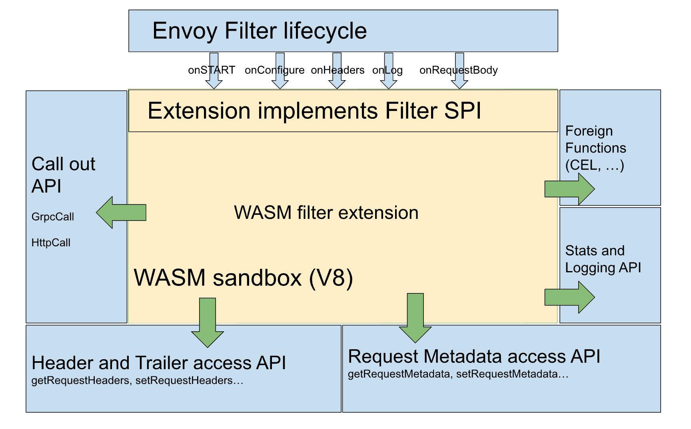

# Wasm-based Envoy filter

## Proxy-Wasm
- Proxy-Wasm is a "proxy-agnostic application binary interface (ABI) standard" that specifies how proxies (host) and Wasm modules interact
   - These interactions are in the form of functions and callbacks
   - It's proxy-agnostic so can be used with other proxies, not just Envoy
- The Proxy-Wasm plugin gets distributed as a Wasm module (.wasm file)
- At runtime, the proxy loads every Wasm module (all .wasm files) into a unique, sandbox VM that's isolated from the host environment
- The proxy creates a separate replica of the Wasm VM for every thread on which the plugin will be executed

## Wasm-based Envoy filters with Proxy-Wasm
- Envoy uses a subset of a V8 VM for the module sandbox VMs
- Envoy uses a multi-threaded model: 1 main thread handles config updates + global tasks, worker threads proxy individual TCP connections/HTTP requests. Worker threads are independent from each other.
- All interactions between the Wasm filter and the host (Envoy Proxy) happens via callback functions provided by the Envoy Proxy Wasm SDK.

### Using the Envoy Proxy Wasm SDK

This includes 3 steps:
- Build code (which implements and uses the ABI)
- Compile code to Wasm
- Deploy the Wasm code to an Envoy proxy

### Wasm-based Envoy Filter Lifecycle

The following diagram is a helpful summary of a Wasm-based Envoy filter lifecycle:

([source](https://docs.eupraxia.io/docs/how-to-guides/deploy-rust-based-envoy-filter/))

#### Initialization

1. The Wasm plugin (Wasm binary containing the filter) is loaded
2. `_start()` function is invoked - good for setup/state initialization
3. A root context is created. The root context has the same lifetime as the sandbox VM it's executed in.
   - The root context is used for: 1) initial setup between plugin and Envoy Proxy, 2) interactions that outlive a single request
4. The Envoy Proxy invokes the `on_configure` method on the `RootContext` when starting the plugin
   - `on_configure` is used to pass in VM/plugin configs

#### Per request

1. For each request, the Envoy Proxy creates a new context that lasts for the lifespan of the request.
2. The `Context` class provides hooks/callbacks (eg. `onXXX(...)`) that are invoked as the Envoy Proxy goes through the filter chain.
   Depending on the level of the filter chain your filter is inserted into, different callbacks are invoked.
   eg. HTTP-level filter chains get the `onRequestHeaders` method invoked, whereas it's not invoked on TCP-level filters.
3. Each callback returns a status that you can use to tell Envoy Proxy whether or not to pass the processing of the stream to the next filter.

## Resources

- [Proxy Wasm ABI spec](https://github.com/proxy-wasm/spec/tree/master/abi-versions/vNEXT)
- [Envoy Proxy Wasm SDK - Rust](https://github.com/proxy-wasm/proxy-wasm-rust-sdk/blob/master/src/traits.rs)
- [How to write Wasm filters for Envoy](https://banzaicloud.com/blog/envoy-wasm-filter/)
- [Tetrate-Episode 07: Developing Envoy Wasm Extensions](https://youtu.be/JIq8wujlG9s?t=1137)
